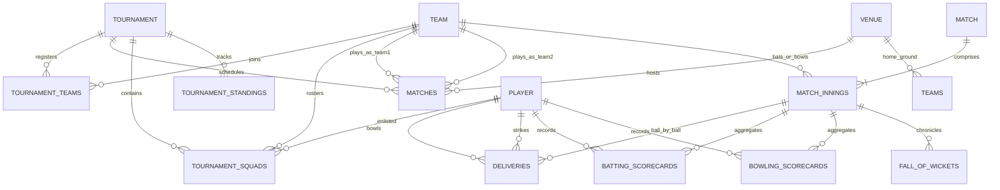

# Cricket Tournament Management System - Database Design

## Overview
This database architecture models a complete cricket ecosystem: multi-stage tournaments, clubs/franchises, player rosters, ball-by-ball match scoring, real-time fall-of-wickets, dynamic Net Run Rate (NRR) standings, and player leaderboards.

## Relational Entity-Relationship Diagram

## Schema Files
- `schema.sql`: Full SQL DDL with tables, indexes, constraints, foreign keys, and views (compatible with PostgreSQL, SQLite, MySQL).
- `schema.prisma`: Production Prisma ORM definition for TypeScript/Next.js/Express backends.
- `seed_data.sql`: Ready-to-run dataset based on the Apex Super League 2026 (6 teams, 20+ players, matches, active live match, and standings).
- `queries.sql`: Pre-tested SQL queries for live scorecards, NRR calculations, Orange/Purple Cap leaderboards, and over timelines.

## Core Formula: Net Run Rate (NRR)
$$\text{NRR} = \left(\frac{\text{Total Runs Scored}}{\text{Total Overs Faced}}\right) - \left(\frac{\text{Total Runs Conceded}}{\text{Total Overs Bowled}}\right)$$
*Note: Decimal overs like 19.4 are converted to $19 + \frac{4}{6} = 19.667$ overs for strict ICC compliance.*
